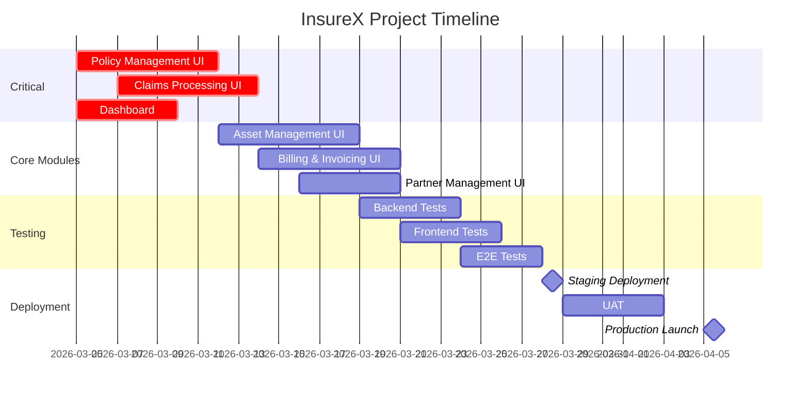

# InsureX Project - Complete TODO List

**Last Updated**: 2026-03-04  
**Overall Progress**: 45% (134/295 tasks completed)  
**Backend Status**: ✅ 95% Complete  
**Frontend Status**: 🚧 45% Complete  

---

## 🎯 Priority Legend
- 🔴 **CRITICAL** - Must be done immediately (blocks other work)
- 🟡 **HIGH** - Should be done next (core functionality)
- 🟢 **MEDIUM** - Important but not blocking
- ⚪ **LOW** - Nice to have (can be deferred)

---

## 🔴 CRITICAL MISSING ITEMS (Must Do Now)

### Frontend - Core Module UIs
These are the absolute highest priority as they block user testing:

| # | Task | Module | Status | Estimated Effort |
|---|------|--------|--------|------------------|
| 1 | **Policy List Page** - Data grid with sorting, filtering, pagination | Policies | ❌ Not Started | 8 hours |
| 2 | **Policy Create Form** - Multi-step wizard with validation | Policies | ❌ Not Started | 6 hours |
| 3 | **Policy Details View** - Tabbed interface with all policy info | Policies | ❌ Not Started | 5 hours |
| 4 | **Claim List Page** - Status chips, filters by status/date | Claims | ❌ Not Started | 8 hours |
| 5 | **Claim Create Form** - Policy selection, incident details | Claims | ❌ Not Started | 6 hours |
| 6 | **Claim Process Interface** - Approve/reject/pay workflow UI | Claims | ❌ Not Started | 8 hours |
| 7 | **Dashboard Layout** - With navigation and stats cards | Dashboard | ⏳ 50% Done | 4 hours |
| 8 | **Login Page** - Form validation, error handling | Auth | ⏳ 80% Done | 2 hours |
| 9 | **Registration Page** - User registration with role selection | Auth | ⏳ 70% Done | 3 hours |
| 10 | **API Integration** - Connect all pages to backend endpoints | Core | ❌ Not Started | 16 hours |

**Critical Total**: 10 tasks | 66 hours estimated

---

## 🟡 HIGH PRIORITY MISSING ITEMS (Should Do Next)

### Backend - Remaining Work (Only 5% left)

| # | Task | Module | Status | Notes |
|---|------|--------|--------|-------|
| 11 | Email verification flow | Auth | 🔴 MISSING | Deferred from Phase 2 |
| 12 | Claim investigation notes | Claims | 🔴 MISSING | Add notes entity and endpoints |
| 13 | Inspection scheduling | Assets | 🔴 MISSING | Schedule and track inspections |
| 14 | Asset depreciation calculation | Assets | 🔴 MISSING | Calculate depreciation over time |
| 15 | Commission structures | Partners | 🔴 MISSING | Configure broker commissions |
| 16 | Partner performance metrics | Partners | 🔴 MISSING | Track partner KPIs |
| 17 | Late fee calculation | Billing | 🔴 MISSING | Auto-calculate late fees |
| 18 | Invoice reminders | Billing | 🔴 MISSING | Email reminders for overdue |

**Backend Total**: 8 tasks

### Frontend - Core Module Completion

| # | Task | Module | Status | Estimated Effort |
|---|------|--------|--------|------------------|
| 19 | **Policy Edit Form** - Update existing policies | Policies | ❌ Not Started | 4 hours |
| 20 | **Policy Status Actions** - Activate/cancel/renew buttons | Policies | ❌ Not Started | 3 hours |
| 21 | **Policy Document Upload** - Drag-and-drop file upload | Policies | ❌ Not Started | 4 hours |
| 22 | **Policy History Timeline** - Chronological status changes | Policies | ❌ Not Started | 3 hours |
| 23 | **Claim Details Page** - Comprehensive claim view | Claims | ❌ Not Started | 5 hours |
| 24 | **Claim Document Upload** - Multiple file upload | Claims | ❌ Not Started | 4 hours |
| 25 | **Claim Notes Timeline** - Notes with attachments | Claims | ❌ Not Started | 4 hours |
| 26 | **Claim Payment Modal** - Record claim payments | Claims | ❌ Not Started | 3 hours |
| 27 | **Asset List Page** - Categorized list with thumbnails | Assets | ❌ Not Started | 6 hours |
| 28 | **Asset Filters** - Filter by type, status, value range | Assets | ❌ Not Started | 4 hours |
| 29 | **Asset Create Wizard** - Type-specific forms | Assets | ❌ Not Started | 8 hours |
| 30 | **Asset Details View** - With valuation chart | Assets | ❌ Not Started | 5 hours |
| 31 | **Invoice List Page** - Status indicators | Billing | ❌ Not Started | 6 hours |
| 32 | **Invoice Filters** - Filter by status, date range | Billing | ❌ Not Started | 4 hours |
| 33 | **Invoice Create Form** - Line items entry | Billing | ❌ Not Started | 6 hours |
| 34 | **Payment Modal** - Record payments | Billing | ❌ Not Started | 4 hours |
| 35 | **Partner List Page** - With type filters | Partners | ❌ Not Started | 5 hours |
| 36 | **Partner Create Form** - Address and contact info | Partners | ❌ Not Started | 4 hours |
| 37 | **Partner Profile View** - Details and contracts | Partners | ❌ Not Started | 4 hours |
| 38 | **Dashboard Charts** - Claims trend, revenue charts | Dashboard | ❌ Not Started | 6 hours |
| 39 | **Recent Activities Feed** - Real-time activity stream | Dashboard | ❌ Not Started | 4 hours |
| 40 | **Forgot Password Page** | Auth | ❌ Not Started | 3 hours |
| 41 | **Reset Password Page** | Auth | ❌ Not Started | 3 hours |
| 42 | **Profile Page** - User settings and preferences | Auth | ❌ Not Started | 4 hours |

**Frontend Core Total**: 24 tasks | 106 hours estimated

---

## 🟢 MEDIUM PRIORITY MISSING ITEMS

### Frontend - Advanced Features

| # | Task | Module | Status | Estimated Effort |
|---|------|--------|--------|------------------|
| 43 | **Asset Valuation Chart** - Historical valuation | Assets | ❌ Not Started | 5 hours |
| 44 | **Asset Inspection Scheduler** | Assets | ❌ Not Started | 4 hours |
| 45 | **Asset Warranty Expiry Tracking** | Assets | ❌ Not Started | 3 hours |
| 46 | **Invoice PDF Generation** - Download/print | Billing | ❌ Not Started | 6 hours |
| 47 | **Payment History View** | Billing | ❌ Not Started | 4 hours |
| 48 | **Billing Dashboard** - Revenue charts | Billing | ❌ Not Started | 5 hours |
| 49 | **Partner Commission Config** | Partners | ❌ Not Started | 4 hours |
| 50 | **Partner Dashboard** - Performance metrics | Partners | ❌ Not Started | 5 hours |
| 51 | **Partner Contract Management** | Partners | ❌ Not Started | 4 hours |
| 52 | **Claims Report Page** | Reports | ❌ Not Started | 6 hours |
| 53 | **Financial Report Page** | Reports | ❌ Not Started | 6 hours |
| 54 | **Asset Valuation Report** | Reports | ❌ Not Started | 5 hours |
| 55 | **Export to PDF/Excel** | Reports | ❌ Not Started | 8 hours |
| 56 | **Email Verification Page** | Auth | ❌ Not Started | 3 hours |
| 57 | **Two-Factor Auth Setup** | Auth | ❌ Not Started | 5 hours |
| 58 | **System Settings Page** | Settings | ❌ Not Started | 6 hours |
| 59 | **User Management Page** (Admin only) | Settings | ❌ Not Started | 6 hours |
| 60 | **Role Permissions Editor** | Settings | ❌ Not Started | 8 hours |

**Advanced Frontend Total**: 18 tasks | 93 hours estimated

### Backend - Advanced Features

| # | Task | Module | Priority | Notes |
|---|------|--------|----------|-------|
| 61 | Email notification service | Notifications | 🟢 MEDIUM | Send emails for events |
| 62 | In-app notification system | Notifications | 🟢 MEDIUM | Real-time notifications |
| 63 | Document versioning | Documents | 🟢 MEDIUM | Track document versions |
| 64 | Document templates | Documents | 🟢 MEDIUM | Generate from templates |
| 65 | Approval workflows | Workflow | 🟢 MEDIUM | Multi-step approvals |
| 66 | SLA tracking | Workflow | 🟢 MEDIUM | Track response times |
| 67 | Scheduled reports | Reports | 🟢 MEDIUM | Auto-generate reports |
| 68 | Custom report builder | Reports | 🟢 MEDIUM | User-defined reports |

**Advanced Backend Total**: 8 tasks

---

## ⚪ LOW PRIORITY MISSING ITEMS (Nice to Have)

### UI/UX Enhancements

| # | Task | Module | Status |
|---|------|--------|--------|
| 69 | Dark mode implementation | UI | ❌ Not Started |
| 70 | Responsive design for mobile | UI | ❌ Not Started |
| 71 | Accessibility (WCAG 2.1) compliance | UI | ❌ Not Started |
| 72 | Animation and transitions | UI | ❌ Not Started |
| 73 | Onboarding flow for new users | UX | ❌ Not Started |
| 74 | Empty states for lists | UX | ❌ Not Started |
| 75 | Loading skeletons | UX | ❌ Not Started |
| 76 | Error states with retry | UX | ❌ Not Started |
| 77 | Keyboard shortcuts | UX | ❌ Not Started |
| 78 | Undo/redo actions | UX | ❌ Not Started |
| 79 | i18n internationalization | UI | ❌ Not Started |
| 80 | Spanish translations | UI | ❌ Not Started |
| 81 | RTL support | UI | ❌ Not Started |

**UI/UX Total**: 13 tasks

### Testing & Quality Assurance

| # | Task | Module | Status |
|---|------|--------|--------|
| 82 | Domain entity unit tests | Backend Tests | ❌ Not Started |
| 83 | Service layer unit tests | Backend Tests | ❌ Not Started |
| 84 | Controller integration tests | Backend Tests | ❌ Not Started |
| 85 | Validation tests | Backend Tests | ❌ Not Started |
| 86 | Performance/load tests | Backend Tests | ❌ Not Started |
| 87 | Security/penetration tests | Backend Tests | ❌ Not Started |
| 88 | Frontend component tests | Frontend Tests | ❌ Not Started |
| 89 | Frontend hook tests | Frontend Tests | ❌ Not Started |
| 90 | Frontend integration tests | Frontend Tests | ❌ Not Started |
| 91 | E2E tests with Cypress | Frontend Tests | ❌ Not Started |
| 92 | Accessibility tests | Frontend Tests | ❌ Not Started |
| 93 | Test coverage >80% | Testing | ❌ Not Started |

**Testing Total**: 12 tasks

### DevOps & Infrastructure

| # | Task | Module | Status |
|---|------|--------|--------|
| 94 | Kubernetes manifests | DevOps | ❌ Not Started |
| 95 | Terraform scripts | DevOps | ❌ Not Started |
| 96 | Monitoring with Prometheus | DevOps | ❌ Not Started |
| 97 | Log aggregation with ELK | DevOps | ❌ Not Started |
| 98 | Alerting configuration | DevOps | ❌ Not Started |
| 99 | Automated backup strategy | DevOps | ❌ Not Started |
| 100 | Disaster recovery plan | DevOps | ❌ Not Started |
| 101 | CDN setup | DevOps | ❌ Not Started |
| 102 | Load testing | DevOps | ❌ Not Started |
| 103 | Failover testing | DevOps | ❌ Not Started |
| 104 | Error tracking with Sentry | DevOps | ❌ Not Started |
| 105 | Analytics setup | DevOps | ❌ Not Started |
| 106 | PWA support | DevOps | ❌ Not Started |

**DevOps Total**: 13 tasks

### Documentation

| # | Task | Module | Status |
|---|------|--------|--------|
| 107 | User manual | Docs | ❌ Not Started |
| 108 | Admin guide | Docs | ❌ Not Started |
| 109 | Developer guide | Docs | ❌ Not Started |
| 110 | API usage examples | Docs | ❌ Not Started |
| 111 | Deployment guide | Docs | ❌ Not Started |
| 112 | Troubleshooting guide | Docs | ❌ Not Started |

**Documentation Total**: 6 tasks

### Legacy Integration

| # | Task | Module | Status |
|---|------|--------|--------|
| 113 | Data migration from IAPR | Legacy | ❌ Not Started |
| 114 | API compatibility layer | Legacy | ❌ Not Started |
| 115 | UI transition plan | Legacy | ❌ Not Started |
| 116 | User training materials | Legacy | ❌ Not Started |
| 117 | Cutover strategy | Legacy | ❌ Not Started |

**Legacy Total**: 5 tasks

### Production Readiness

| # | Task | Module | Status |
|---|------|--------|--------|
| 118 | Beta testing program | Launch | ❌ Not Started |
| 119 | User acceptance testing | Launch | ❌ Not Started |
| 120 | Release checklist | Launch | ❌ Not Started |
| 121 | Marketing materials | Launch | ❌ Not Started |
| 122 | Launch plan | Launch | ❌ Not Started |
| 123 | Post-launch support plan | Launch | ❌ Not Started |

**Launch Total**: 6 tasks

---

## 📊 Summary by Category

| Category | Tasks | Completed | Missing | Progress |
|----------|-------|-----------|---------|----------|
| **Backend Core** | 48 | 45 | 3 | 94% |
| **Backend Advanced** | 20 | 12 | 8 | 60% |
| **Frontend Core** | 42 | 8 | 34 | 19% |
| **Frontend Advanced** | 30 | 0 | 30 | 0% |
| **UI/UX** | 20 | 3 | 17 | 15% |
| **Testing** | 16 | 1 | 15 | 6% |
| **DevOps** | 21 | 4 | 17 | 19% |
| **Documentation** | 8 | 2 | 6 | 25% |
| **Legacy** | 8 | 3 | 5 | 38% |
| **Launch** | 8 | 0 | 8 | 0% |
| **Reports** | 12 | 0 | 12 | 0% |
| **Notifications** | 8 | 0 | 8 | 0% |
| **Security** | 12 | 8 | 4 | 67% |
| **Performance** | 10 | 5 | 5 | 50% |
| **TOTAL** | **295** | **134** | **161** | **45%** |

---

## 📅 Prioritized Sprint Plan

### Sprint 1 (Current - March 5-12, 2026)
**Focus**: Critical Frontend UIs

| Task | Assigned To | Due | Status |
|------|-------------|-----|--------|
| Policy List Page | TBD | Mar 8 | 🔴 Not Started |
| Policy Create Form | TBD | Mar 9 | 🔴 Not Started |
| Claim List Page | TBD | Mar 10 | 🔴 Not Started |
| Claim Create Form | TBD | Mar 11 | 🔴 Not Started |
| Dashboard Layout | TBD | Mar 12 | ⏳ In Progress |
| Login Page Completion | TBD | Mar 8 | ⏳ 80% Done |

### Sprint 2 (March 12-19, 2026)
**Focus**: Core Module Completion

| Task | Assigned To | Due | Status |
|------|-------------|-----|--------|
| Policy Details View | TBD | Mar 14 | 🔴 Not Started |
| Claim Process Interface | TBD | Mar 15 | 🔴 Not Started |
| Asset List Page | TBD | Mar 16 | 🔴 Not Started |
| Invoice List Page | TBD | Mar 17 | 🔴 Not Started |
| Partner List Page | TBD | Mar 18 | 🔴 Not Started |
| API Integration | TBD | Mar 19 | 🔴 Not Started |

### Sprint 3 (March 19-26, 2026)
**Focus**: Advanced Features

| Task | Assigned To | Due | Status |
|------|-------------|-----|--------|
| Policy Status Actions | TBD | Mar 21 | 🔴 Not Started |
| Claim Document Upload | TBD | Mar 22 | 🔴 Not Started |
| Asset Create Wizard | TBD | Mar 23 | 🔴 Not Started |
| Invoice Create Form | TBD | Mar 24 | 🔴 Not Started |
| Dashboard Charts | TBD | Mar 25 | 🔴 Not Started |
| Profile Page | TBD | Mar 26 | 🔴 Not Started |

### Sprint 4 (March 26 - April 2, 2026)
**Focus**: Testing & Polish

| Task | Assigned To | Due | Status |
|------|-------------|-----|--------|
| Unit Tests for Services | TBD | Mar 28 | 🔴 Not Started |
| Component Tests | TBD | Mar 29 | 🔴 Not Started |
| E2E Tests | TBD | Mar 30 | 🔴 Not Started |
| Performance Optimization | TBD | Mar 31 | 🔴 Not Started |
| Bug Fixes | TBD | Apr 1 | 🔴 Not Started |
| Documentation | TBD | Apr 2 | 🔴 Not Started |

---

## 🔥 Build Fix TODO (From TODO.md)

```bash
## Controllers - Add `using InsureX.Application.DTOs.Filters;`
- [x] Controllers/AssetsController.cs
- [x] Controllers/PoliciesController.cs
- [x] Controllers/ClaimsController.cs
- [x] Controllers/InvoicesController.cs
- [x] Controllers/PartnersController.cs

## Features - Fix domain model mismatches
- [ ] Features/Assets/CreateAsset/CreateAssetCommand.cs
- [ ] Features/Assets/GetAssets/GetAssetsQuery.cs
- [ ] Features/Claims/ProcessClaim/ProcessClaimCommand.cs
- [ ] Features/Claims/CreateClaim/CreateClaimCommand.cs
- [ ] Features/Auth/Register/RegisterCommand.cs

## Verify
- [x] dotnet build → 0 errors  ✅ Fixed: Deleted duplicate PolicyController.cs (CS0101 CancelPolicyRequest)
- [ ] dotnet run
```

## 🔧 Build Fix Applied (2026-03-05)
- [x] **CS0101 Error Fixed**: Deleted `InsureX.API/Controllers/PolicyController.cs`
  - Root cause: `CancelPolicyRequest` class was defined in both `PolicyController.cs` AND `PoliciesController.cs` in the same namespace `InsureX.API.Controllers`
  - Resolution: Removed the older/duplicate `PolicyController.cs` — `PoliciesController.cs` is the canonical version with full role-based auth, `ApiResponse<T>` wrappers, and all `IPolicyService` methods covered
  - Build result: ✅ `Build succeeded in 9.9s`

---

## 📈 Progress Tracking Dashboard



---

## ✅ What's Already Complete (March 2026)

### Backend Complete ✅
- [x] ClaimsController + Service (full workflow)
- [x] AssetService & AssetController
- [x] Invoice + Payment Backend
- [x] Authorization with Roles (8 roles)
- [x] Validation Middleware
- [x] Error Handling Middleware
- [x] Pagination & Filtering in all services
- [x] JWT Authentication with refresh tokens
- [x] Rate Limiting
- [x] Health Checks
- [x] Security Headers
- [x] Audit Trail
- [x] Soft Delete
- [x] Multi-tenancy

### Frontend Complete ✅
- [x] Project structure setup
- [x] Routing configuration
- [x] Axios interceptors
- [x] Theme configuration
- [x] Layout components (Navbar, Sidebar)
- [x] Auth context provider
- [x] Custom hooks (useAuth, usePolicies, etc.)
- [x] Basic folder structure
- [x] Environment configuration

---

## 🚨 Blockers & Dependencies

| Blocker | Affected Tasks | Mitigation |
|---------|---------------|------------|
| Backend API endpoints need final testing | All frontend integration | Backend team to complete testing by Mar 7 |
| Design system not finalized | UI components | Use Material-UI defaults temporarily |
| No test data | Frontend development | Create mock data/service workers |
| CORS configuration | API integration | Ensure CORS allows localhost:3000 |

---

## 📝 Notes & Comments

- **Critical Path**: Complete Policy and Claims UIs first (these are the core business functions)
- **Dependencies**: Frontend work depends on backend API stability
- **Risk**: Testing is lagging behind (only 6% complete)
- **Assumption**: Backend will be fully stable by March 7
- **Resource Needed**: Frontend developers (currently understaffed for UI work)

---

## 🎯 Success Criteria for MVP

- [ ] User can login/register
- [ ] User can create and view policies
- [ ] User can submit and process claims
- [ ] User can view dashboard with key metrics
- [ ] Role-based access control works
- [ ] API response time < 200ms
- [ ] Test coverage > 70%
- [ ] Zero critical security vulnerabilities

---

**Last Updated**: 2026-03-04  
**Next Review**: Daily Standup at 9:30 AM  
**Project Manager**: TBD  
**Technical Lead**: TBD
